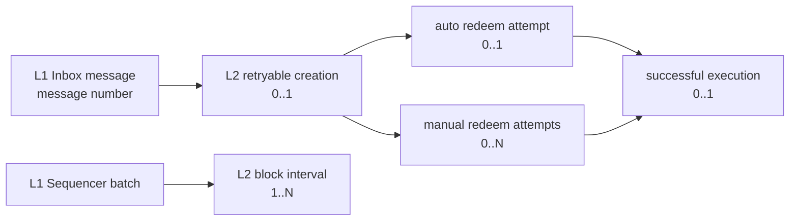

# 对象关系与映射状态机 v0.1

## 对象关系

一条 L1 message 的目标对象关系是：

`一条 L1 message → 一个 L2 ticket/creation object → 0..N 次 redeem 尝试 → 0..1 次成功执行`。

L1 batch 与 L2 block/transaction 默认为区间关系，不能以“一批对应一笔交易”或“时间最近”配对。

## 映射状态

| 状态 | 判断条件 | 置信度 | 允许计算 | 常见失败原因 |
|---|---|---|---|---|
| `exact` | message number、Bridge 字段、官方 SDK 同构 retryable ID 与 L2 receipt 一致 | 高 | `W_ingest`；有成功 redeem 时可算 `W_effect` | receipt 不可得、payload 无法解析、消息种类不适用。 |
| `range` | batch sequence 经 NodeInterface 定位为连续 L2 first/last block | 高（区间） | `P_lag` 与 batch 区间描述 | L2 查询失败、batch 编号不连续、查询范围不足。 |
| `unmapped` | 缺少唯一对象或任一必要证据 | 无/低 | 不计算窗口 | RPC archive 限制、未创建、信息不完整、链上对象不是 retryable。 |

## 禁止规则

1. 禁止以 L1/L2 timestamp 距离最小作为默认配对规则。
2. 禁止将 `range` 状态升级为 transaction-level `exact`。
3. 禁止将“未观测 receipt”写为失败执行；它首先是数据或生命周期状态。
4. 禁止从 batch publication lag 推出 L1 用户消息的反应窗口。

## 本周的实际实现

- batch：`SequencerBatchDelivered` 的 sequence/accumulator/delayed count + `NodeInterface.findBatchContainingBlock` 单调二分定位 L2 区间；保存 first/last block hash。
- message：`InboxMessageDelivered` 与 `Bridge.MessageDelivered` 按 `message_number` 连接；仅 kind=9 的 payload 经官方 SDK 同构 EIP-2718/RLP/Keccak 规则派生 retryable creation ID，再查询 L2 receipt。
