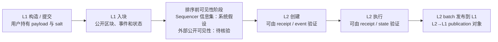

# 问题定义与系统模型 v1.0

## 1. 题目收缩与研究目标

**暂定题目：单 Sequencer L2 Rollup 中跨层交易可见性与排序操纵面：问题定义、威胁模型与最小约束设计。**

原表述“跨层 MEV 防御”覆盖对象、攻击主体、收益类型和防御层次过多，容易在没有对象语义和证据时直接跳到协议。修订题目先问一个更小、可证伪的问题：**L1 发起并在 L2 创建或执行的对象，在排序承诺前有哪些内容可能被谁看见；若某角色拥有相关行动能力，是否存在需要进一步验证的排序操纵面？**

本周的交付是定义、假设、证据要求和验证设计。它不主张 Arbitrum 已出现可利用 MEV，不主张已完成任何协议或实验。

## 2. 研究对象、对照对象与排除项

| 类别 | 定义 | 在本研究中的地位 | 不能混同为 |
|---|---|---|---|
| 跨层 message/transaction object | 由 L1 发起，之后在 L2 创建、调度或执行的对象 | 主研究对象 | 任意 L2 直接交易或任意 batch |
| L2 直接提交交易 | 直接进入 L2 提交/排序流程的交易 | 对照对象，用于区分直接排序与跨层生命周期 | L1→L2 message |
| L2 排序与执行 | L2 中纳入、相对排序和状态转换的过程 | 分析可能行动能力的阶段 | 历史数据中已直接观察到的私有队列 |
| L2 batch 向 L1 发布 | 已形成的 L2 批次向 L1 的发布/提交关系 | 辅助理解 L2→L1 publication 的对象 | L1 用户消息进入 L2 的主窗口 |
| message visibility | 某角色在某阶段可取得的对象内容、元数据或关联状态 | 需按角色和阶段声明 | 已被历史 RPC 完整记录的事实 |
| batch publication lag | L2 已形成批次与其向 L1 发布之间的时间关系 | 后续 V1 的辅助对象 | L1→L2 用户消息时序窗口 |

### 2.1 生命周期与阶段信息集

| 阶段 | 对象状态 | Sequencer 可见信息 | 外部 searcher 可见信息 | 普通用户可见信息 | 可采取动作 | 历史数据可验证性 |
|---|---|---|---|---|---|---|
| L1 构造/提交 | 用户构造跨层请求 | 不作统一断言 | 不作统一断言 | 自己的 payload 与提交结果 | 用户可提交/撤回取决于入口 | 通常不能恢复 first-seen |
| L1 入块 | L1 交易/事件已链上 | 公共链上信息；更早接收信息是否存在为系统假设 | 公共区块、事件、状态 | 交易入块结果 | 角色只能基于各自信息集行动 | block、receipt、log 可验证 |
| 排序前可见性 | 对象等待进入 L2 排序/创建 | 若对象已到达 Sequencer，内容/到达顺序是否可见需由 V0 核验 | 仅公开信息；不默认看见私有队列 | 自己对象与公开状态 | Sequencer 可能纳入、延后、相对排序；searcher 仅提交自身交易 | 私有队列与真实先到时间不可由历史 RPC 直接验证 |
| L2 创建 | L2 上出现创建对象 | 已链上对象 | 已链上对象 | 已链上对象 | 后续交易或执行，受协议约束 | receipt/event/block 可验证 |
| L2 执行 | 状态转换已完成或失败 | 已链上对象与结果 | 已链上对象与结果 | 已链上对象与结果 | 对已执行顺序不能追溯改变 | receipt/status/state 可验证 |
| batch 发布到 L1 | L2 历史被提交/发布到 L1 | 公共发布数据 | 公共发布数据 | 公共发布数据 | 发布后不能反推出排序前可见性 | L1 event、batch 元数据可验证 |

> 关键边界：图中的“排序前可见性阶段”不是被历史链上数据直接观察到的事实。对于 Sequencer，它是与实现和提交接口有关的**系统假设/待核验对象**；对于外部 searcher，只有公开信息出现之后的可见性可被保守地讨论。

## 3. 系统假设

1. 链结构为 Ethereum L1 + Arbitrum 类 optimistic Rollup；本研究只对该抽象系统提出问题，不声称所有 Rollup 具有相同实现。
2. L2 采用单 Sequencer 作为排序责任主体。其可在协议允许范围内影响纳入、延迟和相对顺序；“插入自营交易”或“与 searcher 共谋”必须另加假设。
3. 主对象是 L1 发起、随后在 L2 创建/执行的对象；L2 直接交易作为对照；batch publication 只讨论 L2→L1 关系。
4. 历史 RPC 只能用于核验已上链 block、receipt、event 与最终状态，不能恢复公共 mempool 的真实 first-seen，也不能恢复 Sequencer 私有队列。
5. 本研究不默认 Sequencer 恶意、自营或共谋，不把攻击利润、地址实体身份或攻击频率当作已可观测数据。

## 4. 为什么 batch publication lag 不是主窗口

L1→L2 用户对象的关键关系是“L1 发起对象何时成为可创建/可执行的 L2 对象”；batch publication 则是“已形成的 L2 批次何时向 L1 发布”。两者方向相反、对象不同、可见性含义不同。即使后者存在较长滞后，也不能推出用户消息在前者存在相同长度的可利用时间，更不能推出任何主体已经获利。

论文 06 以 ordering domain 与 cross-domain 协调为概念边界，论文 14 对 Rollup 中排序和 batch 提交作架构性讨论；二者只支持“应区分对象”，不提供本项目的时间或攻击实证。

## 5. 统一术语表

| 术语 | 本文定义 | 使用限制 |
|---|---|---|
| 可见性（visibility） | 某角色可获得对象内容、元数据或关联状态的能力 | 必须注明角色、阶段和证据类型 |
| 排序操纵面 | 在给定能力下可能影响相对顺序、纳入或延迟的决策空间 | 不等同于已发生操纵 |
| 可利用性 | 存在信息、行动、状态、有效反事实和正净收益的完整链条 | 缺任一项即不确认 |
| public first-seen | 交易首次对公共观察者可见的时刻 | 非历史 block timestamp 的替代品 |
| batch publication lag | L2 批次发布至 L1 的时间关系 | 不是用户消息主窗口 |
| blind ordering | 排序决策前不暴露完整 payload 的设计目标 | 仍可能暴露元数据 |
| commit-reveal | 先提交 commitment、后揭示并验证的协议模式 | 不是自动的公平/抗审查保证 |

## 6. 反例：为什么时间或可见性不足以推出 MEV

1. **有时间差但无可获利动作**：某 message 的 L1 入块与 L2 创建之间有可定义间隔，但其 payload 不改变任何可交易状态，外部主体没有可产生正收益的动作；时间差不构成 MEV。
2. **Sequencer 可见但反事实无效**：Sequencer 能读到一笔 swap，但尝试插入交易后会导致用户交易因滑点约束 revert，或自身交易成本超过收益；可见性未转化为有效、盈利序列。
3. **batch 发布滞后较长**：一个 L2 批次晚于其内部执行时间才被发布到 L1；这只描述 L2→L1 发布，不说明某条 L1 message 从入块到 L2 创建经历了相同时间，更不说明谁能利用它。

## 7. 本周可成立与不可成立的结论

**可成立**：本研究已将对象、阶段、角色、证据边界和验证路线写成可核验模型。

**不可成立**：Arbitrum 存在某长度跨层窗口、该窗口可利用、Sequencer 已操纵、外部 searcher 已获利，或 commit-reveal 已降低 MEV。这些需要后续 V0–V4 的一手对象语义、数据、反事实与实现证据。
